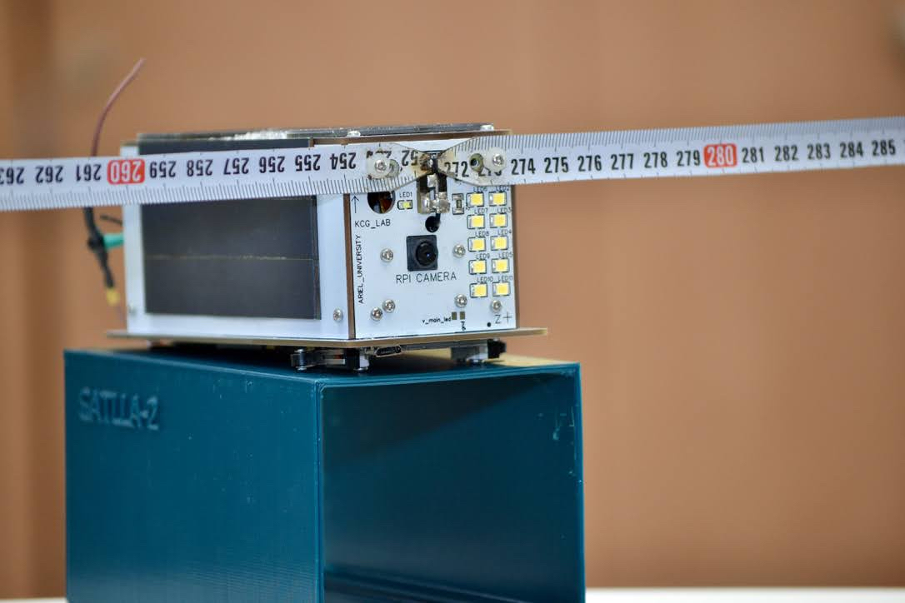
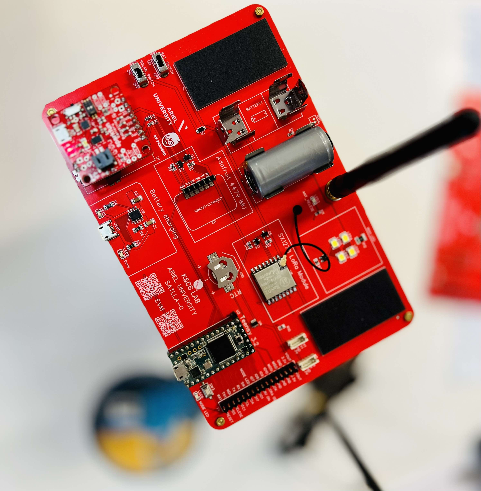

[](https://zenodo.org/badge/latestdoi/575807899)
[](https://doi.org/10.21105/joss.05147)

# Overview
**SATLLA-0**, also known as satllazero, is an open-source project that aims to develop a fully functional pico-satellite. The project includes both the software and hardware of the pico satellite, as well as a ground station. The goal of the project is to enable any science class (in high school or university) to experience the "new space" at a fraction of the price of existing solutions.

# Our Vision
The SATLLA-0 project is all about building a fully functional pico-satellite that's based on a design that's already been launched into space (see [SATLLA-2B](https://tinygs.com/satellite/SATLLA-2B)). Researchers and 12K students can get involved, and the project includes the software, hardware, and ground station you need to make it happen. The goal is to make it possible for any science class to experience the "new space" without breaking the bank.




## Table of contents

- [Description](#description)
- [What's included](#whats-included)
- [Features](#features)
- [Features](#Features)
- [Supported Hardware](#supported-Hardware)
- [SATLLA-0 EVM Board](#satlla-0-evm-board)
- [Installation](#installation)
- [For more info](#for-more-info)
- [Bugs and feature requests](#bugs-and-feature-requests)
- [Copyright and license](#copyright-and-license)
- [Links](#links)
- [Citation](#citation)


## Description
The SATLLA-0 core flight system is an open-source flight software that is used by the SATLLA-2B satellite. The library was designed to be a starting point for academic institutions and schools that want to build or experiment with a laboratory or functional nanosatellite. The system has three main components: the Master, the on-board computer, and the Ground Station. For more information on each component, please see the following section. The main library contains the satellite's flight software, written in Arduino. Arduino is a C/C++ based programming language that is open source and easy to learn. This library was developed for the Teensy 3.x/4.x microcontroller family, which is the main microprocessor unit (MPU) of the SATLLA-2B nanosatellite. However, the library can be compiled for other microcontrollers using the definitions available in the library.


## What's included
The repo is structured as follows:
+ software: The flight software is divided into three sub-folders:
  + SAT0_Ground: The ground station module written in Arduino [SAT0_Ground](/software/SAT0_Ground).
  + SAT0_Master: The satellite main computer module written in Arduino [SAT0_Master](/software/SAT0_Master)
  + SAT0_OBC: The on-board computer (OBC) module written in Python [SAT0_OBC](/software/SAT0_OBC).
+ hardware: Contains the hardware schematics of the satellite.
+ MD: Contains MD files describing the satellite commands, beacons and bill of materials (BOM).
+ stl: Contains 3D sketches.
+ paper: Contains the JOSS submission paper.

The SATLLA-0 libraries offer the ability to be used independently, meaning that each library component may be utilized separately according to the user's specific requirements. For instance, the SAT0_MASTER satellite flight software can be integrated with alternate ground station software. However, it is essential to know that adjustments relating to radio frequencies and message structures are needed.


## Features
The SATLLA-0 flight software platform includes the following key features:
+ A functional nanosatellite based on a Teansy microcontroller which supports the following subsystems: 
  + 2P structure.
  + Electrical Power System (EPS).
  + Telecommand and communications based on LoRa UHF and S-band. 
  + GPS.
  + Inertial Measurement Unit (IMU).
  + Thermistors (Temperature).
  + High-power array LED.
+ An on-board computer (OBC) for research activities based on a RaspberryPi Zerro.
  + Linux-based 
  + Integrated camera.
  + Variety of payloads including Attitude Determination and Control System (ADCS) based on reaction wheels, an Automatic Dependent Surveillance-Broadcast (ADS-B) receiver for surveillance aircraft.
+ A functional ground station based on an ESP32 board.


## Supported Hardware
A list of all the hardware required to assemble a functional nanosatellite is available [here](/MD/bom.MD).
The following boards are being used in this repository:
+ SAT0_Ground: WiFi LoRa ESP32 from Heltec or TTGO.
+ SAT0_Master: Teensy 3.6/4.1 microcontroller.
+ SAT0_OBC: RPI-Zero or RPI-Zero-W.


## SATLLA-0 EVM Board
The SATLLA-0 evaluation board is specifically designed for flat CubeSats, offering a comprehensive platform for testing and experimenting with various satellite functionalities. This evaluation board incorporates a wide range of satellite sensors, enabling researchers and engineers to assess and explore the full capabilities of the SATLLA-0 system. By providing access to most of the essential sensors used in satellites, the board allows for in-depth evaluation and analysis of different aspects, such as thermal management, power optimization, and communication protocols.
Please refer to [EVM_BOARD](/hardware/evm_board) for more details.


## Installation
SATLLA-0 is written in Arduino, and can be installed via Arduino, Teensyduino or any other IDE supporting Arduino.
Please refer to [wiki](https://github.com/kcglab/satllazero/wiki) for details installation.


## For more info
For more into on SATLLA-0, its workings, inputs, outputs and more see the [wiki](https://github.com/kcglab/satllazero/wiki).


## Bugs and feature requests
Please submit bug reports and feature requests to the issue tracker on GitHub: [SATLLA-0 issue tracker](https://github.com/kcglab/satllazero/issues)


## Copyright and license
This program is released as open source software under the terms of [GPL3 License](https://github.com/kcglab/satllazero/blob/main/LICENSE).


## Links
1. A great place to learn more on SATLLA project: [SATLLA Channel](https://www.youtube.com/watch?v=bJ7NgBDLjMQ)
2. SATLLA 2 DIY KIT Assembly [iFixIt Build Instructions](https://www.ifixit.com/Guide/SATLLA+2+DIY+KIT+Assembly/147004)
3. A good starting point is to use a Weather Balloons: [Extreme Long-RAnge Wi-Fi](https://www.youtube.com/watch?v=0xc7XjHUJkM&t=41s)


## Citation
If you'd like to cite us in a project or publication, please include a reference to the JOSS paper:
```
@article{Ronen_SATLLA0_A_Flight_2023,
  author = {Ronen, Rony and Britvin, Michael and Moshe, Boaz Ben},
  doi = {10.21105/joss.05147},
  journal = {Journal of Open Source Software},
  month = jun,
  number = {86},
  pages = {5147},
  title = {{SATLLA0: A Flight Software Platform for Aerospace and STEM Education}},
  url = {https://joss.theoj.org/papers/10.21105/joss.05147},
  volume = {8},
  year = {2023}
}
```


Ariel University. 2023.


## Troubleshoot
* Issue w/Actions
